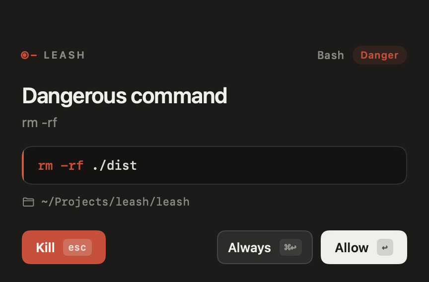

# Leash


Seatbelt for coding agents.

A Mac menu bar app that is **mission control** for coding agents: a job HUD for the plan → act → review loop, with **Allow / Always / Kill** gates, a result you can rewind, and no chat transcript.

Works with **Cursor** (app + CLI), **OpenCode**, **Claude Code**, **Codex**, **Hermes**, **Grok**, and any agent that speaks hooks or ACP. Local only. No account. No model.

<p align="center">
  
</p>

## What it does

1. Installs hooks (or a tiny plugin) into the agents you use.
2. Mission Control opens as a floating HUD: a **job**, not a chat transcript. The live strip speaks in consequences (`delete ./dist`), not tool names.
3. Safe inspection (`git status`, reads) passes through with no gate and stays off the tape.
4. Dangerous calls wait on a keyboard-first panel: `rm -rf`, `sudo`, `curl | sh`, force-push, `.env`, writes outside the project.
5. Review is the files that changed. **Rewind** puts those files back. Always-allow rules and watched folders can be revoked from the menu.

You can still start agents from their own apps. Or send a job from Leash: **Mission Control** has a composer when idle, and `leash run` starts one installed agent. One job at a time, same working tree. Not a chat, not a fan-out.

## Quick start (Mac)

You need Go 1.22+ and Xcode 15+ (macOS 14).

```bash
make install          # builds ~/.leash/bin/leash and writes hooks
open macos/Leash.xcodeproj
```

Run the **Leash** target. A clip-and-strap mark appears in the menu bar.

1. **Watch folders** — pick the repos you vibe-code in. Leash also learns a folder when an agent first runs there.
2. Leave Leash running. It starts the local daemon for you.
3. Use Cursor, OpenCode, `claude`, or `codex` as usual — even several at once, in several folders.
   Or send a job from Mission Control / `leash run "fix the login"`.
   Point an ACP client at `leash acp cursor` (or `opencode` / `hermes` / `grok`) when the agent has no hook file.
4. When something scary is about to run, the panel appears.
   - **Kill / interrupt** — Esc
   - **Allow** — Return
   - **Always** — ⌘Return (exact command/path match in that folder, not a prefix)
   - **Steer** — ⌘L
   - **Rewind** — ⌘Z

Record the demo without waiting for a real agent:

```bash
~/.leash/bin/leash demo mission
```

That runs a toy plan → tool → failing tests → `rm -rf ./dist` gate. Open **Mission Control** from the menu bar.

## CLI (no UI)

The engine is a local daemon on `127.0.0.1:17332`.

```bash
make leash
./bin/leash serve          # in one terminal
./bin/leash install
./bin/leash watch .
./bin/leash run "fix the login"
./bin/leash run --agent claude --fallback "fix the login"
./bin/leash run --list
./bin/leash demo           # blocks until you decide
# other terminal:
./bin/leash status
./bin/leash acp cursor     # ACP permission socket (Zed, cursor-agent, …)
./bin/leash decide <id> kill
./bin/leash always         # list always-allow rules
./bin/leash always --remove 1
./bin/leash undo
```

If the daemon is down, hooks **fail open** so agents keep working. `leash acp` also allows.

## Send a job

`leash run` starts **one** installed agent with a task. Auto-pick prefers Claude, then Codex, OpenCode, then ACP agents (Cursor CLI, Hermes, Grok). The Cursor app is not spawnable — use `cursor-agent`.

```bash
leash run "fix the login"
leash run --agent claude "fix the login"
leash run --agent claude --fallback "fix the login"   # if Claude is missing, try the next one
```

The daemon owns the process. Mission Control shows the job. **Cut** / `leash interrupt` kills it. Steer still injects into the next tool; this is not a second composer.

It will not start a second job while one is running. It does not fan out onto the same checkout.

## Agents

Leash does not replace the agent’s UI. It finds what you already installed (`leash status`) and sits in front of the dangerous call.

| Agent | Door | How |
|---|---|---|
| Cursor app | hooks | `~/.cursor/hooks.json` |
| Cursor CLI | ACP | `leash acp -- cursor-agent acp` |
| OpenCode | hooks + ACP | plugin, or `leash acp -- opencode acp` |
| Claude Code | hooks | `~/.claude/settings.json` |
| Codex | hooks | `~/.codex/hooks.json` |
| Hermes / Grok | ACP | `leash acp hermes` / `leash acp grok` |
| Custom / work agent | hook JSON | [docs/INTEGRATION.md](docs/INTEGRATION.md) |

Home-grown agents: POST the same JSON to `http://127.0.0.1:17332/v1/hook` or spawn `leash hook`. ACP agents: put `leash acp -- <command>` in the client’s agent command. That is the path for a private work agent without forking Leash.

## What gets a prompt

| Kind | Examples |
|---|---|
| Danger | `rm -rf`, `sudo`, `curl \| sh`, `git push --force`, `git reset --hard`, `chmod 777`, db reset |
| Secret | `.env`, `id_rsa`, `*.pem`, `.npmrc`, `~/.aws/credentials` |
| Outside | write/edit path outside that project's watched folder |

Normal source edits and read-only commands do **not** prompt. They still snapshot when they mutate, so undo works. Undo restores the last burst in the folder that was touched most recently — two projects stay separate.

## Layout

```
cmd/leash/           CLI + daemon
internal/policy/     allow vs ask
internal/burst/      file snapshot + undo
internal/mission/    plan → act → review timeline
internal/server/     localhost HTTP
internal/install/    Cursor, Claude, Codex, OpenCode wiring
docs/INTEGRATION.md  protocol for any other agent
macos/Leash/         SwiftUI menu bar + approval panel
internal/agents/     which CLIs and hook files are on this Mac
internal/dispatch/   pick and start one installed agent
internal/acp/        ACP permission socket + one-shot host
```

## 15-second clip

Mute. One take.

1. Terminal: agent wants `rm -rf` or `cat .env`
2. Native panel, Kill
3. Menu bar: undo last burst (optional)

Caption: *Seatbelt for coding agents. Local. Allow / Kill / Undo.*

## Notes

- Codex hooks are opt-in (`codex_hooks = true` in `~/.codex/config.toml`). Leash adds that line. You may still need `/hooks` in Codex to trust the command.
- Not a sandbox. The agent still runs as you. This is an interrupt + rewind, not a VM.
- OpenCode loads `~/.config/opencode/plugins/` automatically; restart OpenCode after `leash install`.
